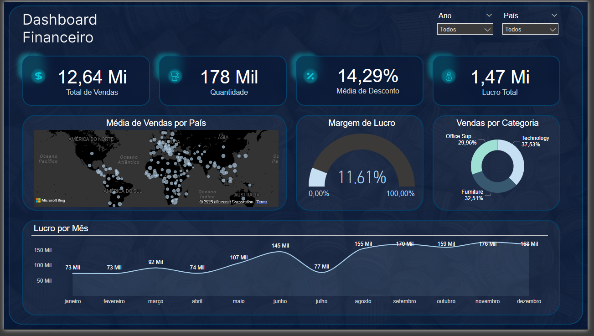

# Projeto de Power BI: Dashboard Financeiro - Global Superstore Sales

## Descrição do Projeto

Este projeto foi desenvolvido utilizando o **Power BI** com foco em criar um **Dashboard Financeiro** para a análise de vendas da Global Superstore. O objetivo principal foi fornecer uma visão clara e objetiva dos indicadores chave de desempenho (KPIs) mais relevantes para a empresa, com a possibilidade de customização por meio de filtros de país e ano.

## Dataset Utilizado

O dataset **Global Superstore Sales** contém informações detalhadas sobre vendas de produtos em diferentes categorias e subcategorias, além de dados de clientes, regiões, países, e datas de transações. Os principais campos utilizados no projeto foram:

- **Order Date**: Data do pedido.
- **Sales**: Valor total das vendas.
- **Profit**: Lucro obtido por venda.
- **Discount**: Percentual de desconto aplicado.
- **Category**: Categoria dos produtos vendidos.
- **Country**: País onde a venda foi realizada.

## KPIs e Visualizações

### 1. Lucros por Mês

A primeira visualização do dashboard apresenta um gráfico de linhas, demonstrando a evolução dos lucros ao longo dos meses. Isso permite ao usuário observar o desempenho financeiro em diferentes períodos e identificar tendências ou sazonalidades.

**Ferramentas utilizadas**: Gráfico de Linhas, DAX para cálculo de lucro total.

### 2. Margem de Lucro

Um KPI visual que mostra a margem de lucro média da empresa. A métrica foi calculada com base no total de lucros dividido pelo total de vendas, destacando o percentual de lucratividade ao longo do tempo.

**Ferramentas utilizadas**: Medida DAX para calcular a Margem de Lucro.

### 3. Média de Desconto em Percentagem

Este KPI exibe a média de desconto concedida em todas as transações, auxiliando na análise de estratégias de preços e promoções. O valor foi calculado como a média ponderada dos descontos aplicados.

**Ferramentas utilizadas**: Cartão de KPI, DAX para cálculo da média de desconto.

### 4. Mapa de Vendas por Países

Foi criado um mapa de calor para visualizar o volume de vendas por país. As regiões com maior volume de vendas são destacadas com cores mais fortes, proporcionando uma visão geográfica das operações globais da empresa.

**Ferramentas utilizadas**: Mapa de Calor, Power BI Map.

### 5. Gráfico de Setores por Categorias

Essa visualização mostra a distribuição das vendas por categorias de produtos em um gráfico de setores. Assim, o usuário pode rapidamente identificar as categorias com maior participação no total de vendas.

**Ferramentas utilizadas**: Gráfico de Setores (Pie Chart), Segmentação por Categoria.

## Filtros e Interatividade

- **Filtro por Ano**: O dashboard inclui um slicer para seleção do ano de análise, permitindo uma visão filtrada por períodos específicos.
- **Filtro por País**: Também foi implementado um filtro por país, facilitando a análise de vendas e lucros em regiões específicas.

## Benefícios e Insights

Com este dashboard, é possível:

1. **Monitorar a saúde financeira** da Global Superstore através de KPIs de fácil visualização.
2. **Identificar padrões de venda e lucratividade** ao longo de meses e regiões.
3. **Avaliar a eficácia das políticas de desconto** e suas influências nas margens de lucro.
4. **Explorar oportunidades de crescimento** em diferentes países e categorias de produtos.

---

# Ferramentas Utilizadas

- **Power BI**
- **DAX** (Data Analysis Expressions)
- **Global Superstore Sales Dataset**

---

# Conclusão

Este dashboard proporciona uma visão clara das operações da Global Superstore, focando em indicadores financeiros importantes, e oferece aos tomadores de decisão uma ferramenta poderosa para análise detalhada de vendas e lucros. Filtros dinâmicos por país e ano aumentam ainda mais a interatividade e flexibilidade da análise.

Este projeto foi uma excelente oportunidade para aprimorar minhas habilidades em **Business Intelligence**, **DAX**, **análise de dados**, e **visualização de dados** com **Power BI**, além de reforçar meu entendimento sobre como transformar dados em insights relevantes para decisões estratégicas.